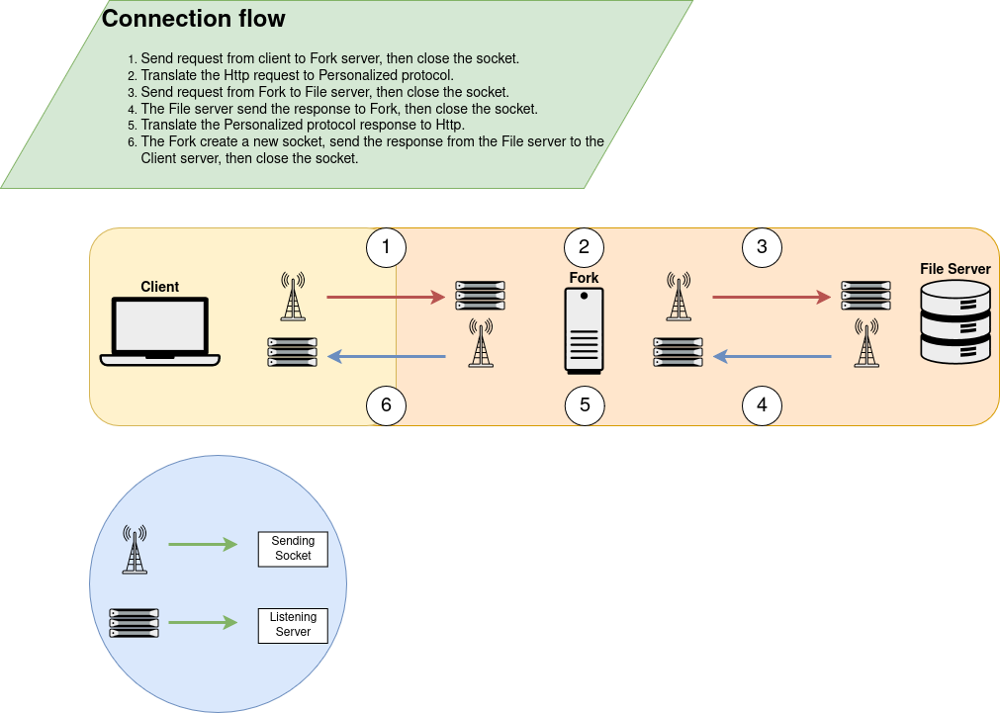
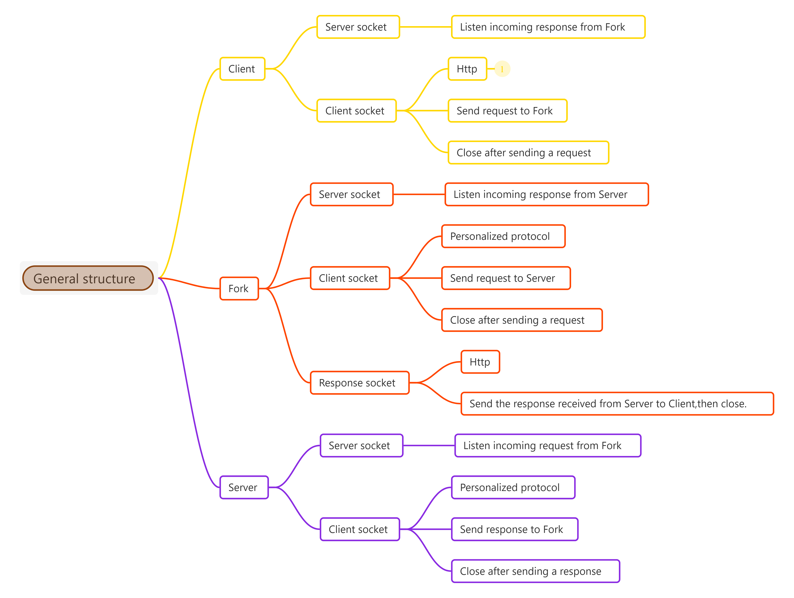

Protocolo Personalizado, primera version
========================================

Cliente Tenedor
---------------

El directorio de los archivos se solicita con un comando Http, como por
ejemplo `GET /` o `GET /DIR`, esto imprimiría algo como lo siguiente:

    carpeta1
    carpeta2

Tenedor Servidor
----------------

El tenedor convertiría los `GET` de `HTTP` en `TAKE` del protocolo
personalizado, así mismo el protocolo tiene sus propios "métodos", por
ejemplo, al usar `TAKE menu` se imprimiría el listado de las figuras:

    fig1.txt  
    fig2.txt

De igual forma `TAKE ls` debería imprimir el directorio actual:

    carpeta1
    carpeta2

Y al usar `TAKE ls carpeta1` deberia imprimir el directorio de la
carpeta1 y contenido:

    subcarpeta
    figura.txt

Servidor Tenedor
----------------

Por último, el servidor recibe en notación `TAKE` y con algun
diccionario anexa las funciones según las opciones o etiquetas:

    TAKE ls -> retorna el directorio.
    TAKE menu -> retorna el listado de figuras.
    TAKE aergfef -> ERROR: comando desconocido.
    TAKE /figuras/ballenita.txt -> __ \ / __
                                  /  \ | /  \
                                      \|/
                                 _,.---v---._
                        /\__/\  /            \
                        \_  _/ /              \
                          \ \_|           @ __|
                           \                \_
                            \     ,__/ 2025  /
                          ~~~`~~~~~~~~~~~~~~/~~~~

Conclusion
----------

A grandes rasgos, el cliente envía en `HTTP`, el tenedor se encarga de
recibirlo y enviarlo al servidor como `PROTOCOLO TAKE`, a su vez el
servidor retorna en notación `TAKE` y el fork le da la respuesta del
servidor al cliente en protocolo `HTTP`, funcionando así como un
traductor.

Recursos
--------

A continuación algunos recursos visuales para entender un poco el
funcionamiento. Recurso visual que ilustra la conexión
`Cliente -> Fork -> Server`

Recurso visual para comprender un poco la estructura de los componentes.

