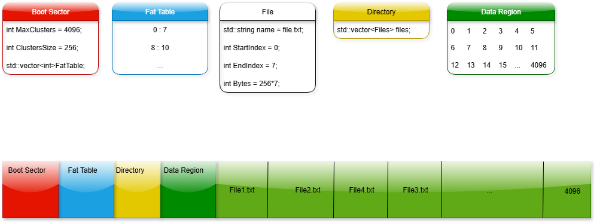

## Propósito del sistema

Este sistema simula el funcionamiento de un sistema de archivos tipo FAT (File Allocation Table) para almacenar, leer y administrar figuras en formato ASCII. Está diseñado para integrarse con el protocolo de comunicación entre clientes, tenedores (Book-keepers) y servidores de figuras.

---

## Estructura del sistema

El sistema se divide en cuatro componentes principales:

| Componente     | Descripción                                                                 |
|----------------|------------------------------------------------------------------------------|
| Boot Sector    | Contiene metadatos del sistema: número máximo de clústeres, tamaño por clúster. |
| FAT Table      | Vector que indica el estado y encadenamiento de cada clúster.               |
| Root Directory | Lista de archivos con nombre, tamaño y clúster inicial.                     |
| Data Region    | Matriz que simula el disco, donde se almacenan los datos reales.            |

### Parámetros definidos:
```cpp
int MaxClusters = 4096;
int ClusterSize = 256;
std::vector<int> FatTable;
std::vector<File> Directory;
std::vector<std::vector<char>> DataRegion;
```

---

## Funcionamiento

### 1. Agregar archivo (figura)
- Se calcula cuántos clústeres se necesitan según el tamaño del archivo.
- Se buscan clústeres libres en la FAT.
- Se encadenan los clústeres en la FAT.
- Se escribe el contenido en la Data Region.
- Se registra el archivo en el directorio.

### 2. Leer archivo
- Se busca el archivo en el directorio.
- Se recorre la cadena de clústeres en la FAT.
- Se reconstruye el contenido desde la Data Region.

### 3. Eliminar archivo
- Se libera cada clúster usado (FAT[i] = -1).
- Se elimina la entrada del archivo en el directorio.

---

## Ejemplo de encadenamiento

```plaintext
FAT[0] = 7
FAT[7] = 8
FAT[8] = 9
FAT[9] = 0  ← fin de archivo
```

Archivo `file.txt` ocupa clústeres 0 → 7 → 8 → 9.  
Donde ```0``` indica fin del archivo, ```-1``` indica que el cluster está libre y ```> 0``` indica que apunta hacia otro indice.

---

## Ejemplo de entrada en el directorio

```cpp
File file = {
  name: "file.txt",
  StartIndex: 0,
  EndIndex: 9,
  Bytes: 256 * 4
};
```

---

## Uso en el protocolo

- El servidor de figuras utilizaría este sistema para almacenar y recuperar figuras solicitadas por el tenedor.
- El tenedor consulta el listado de figuras disponibles y solicita una específica.
- El servidor responde con el contenido leído desde el sistema FAT.

---

## Consideraciones

- El sistema es escalable: puede aumentar ```MaxClusters``` sin modificar la lógica.
- Fragmentación puede ocurrir al eliminar archivos; proximamente se implementara un método de desfragmentación para realocar los clusters de manera continua.
- El sistema está diseñado para simular FAT12 inicialmente.

## Diagrama
