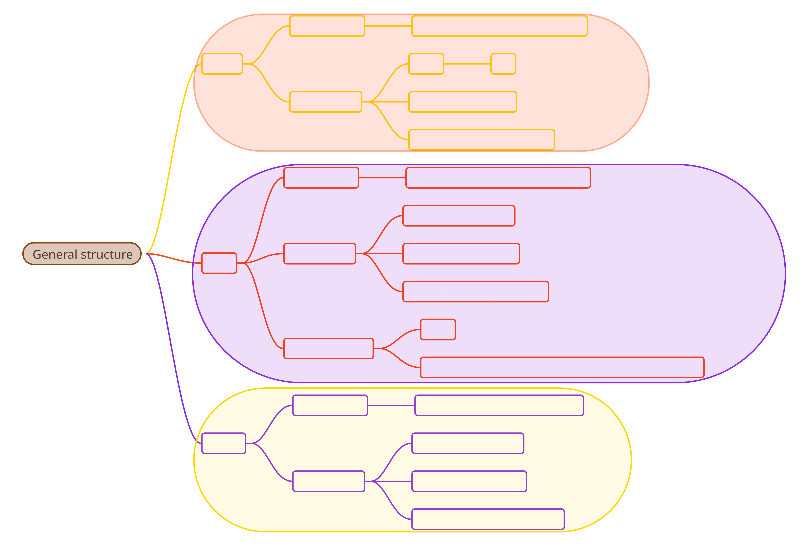

# Protocolo Personalizado
## Cliente Tenedor
El directorio de los archivos se solicita con un comando Http, como por ejemplo ```GET /``` o ```GET /DIR```, esto imprimiria algo como lo siguiente:  
```
carpeta1
carpeta2
```
## Tenedor Servidor
El tenedor convertiria los ```GET``` de ```HTTP``` en ```TAKE``` del protocolo personalizado, asi mismo el protocolo tiene sus propios "metodos", por ejemplo, al usar ```TAKE menu``` se imprimiria el listado de las figuras:  
``` 
fig1.txt  
fig2.txt
```
De igual forma ```TAKE ls``` deberia imprimir el directorio:  
```
carpeta1
carpeta2
```
## Servidor Tenedor
Por ultimo, el servidor recibe en notacion ```TAKE``` y con algun diccionario anexa las funciones segun las opciones o etiquetas:
```
TAKE ls -> retorna el directorio
TAKE menu -> retorna el listado de figuras
TAKE aergfef -> ERROR: comando desconocido
TAKE fig1.txt ->__ \ / __
               /  \ | /  \
                   \|/
              _,.---v---._
     /\__/\  /            \
     \_  _/ /              \
       \ \_|           @ __|
        \                \_
         \     ,__/ 2025  /
       ~~~`~~~~~~~~~~~~~~/~~~~
```
## Conclusion
A grandes rasgos, el cliente envia en ```HTTP```, el tenedor se encarga de recibirlo y enviarlo al servidor como ```PROTOCOLO TAKE```, a su vez el servidor retorna en notacion ```Take``` y el fork le da la respuesta del servidor al cliente en protocolo ```HTTP```, funcionando asi como un traductor.

## Recursos
A continuacion algunos recursos visuales para entender un poco el funcionamiento.

